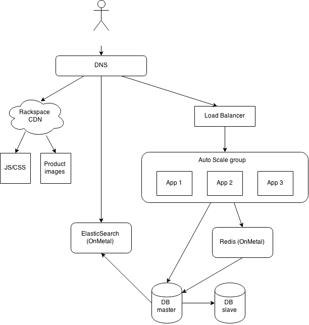

# Distributed eCommerce platform

## Digram

## Ansible
Todo

## Heat
Todo

## Specification

- Rackspace CDN, caching certain DNS records and subdomains
- Static assets (JS and CSS files), along with product images, stored in Cloud Files
- Load Balancer using content caching and `ROUND_ROBIN` algorithm
- Web apps running Magento Community, PHP 5.6 (with xdebug disabled), nginx, php-fpm
- Redis OnMetal instance acting as an in-memory cache will fallback to database
- Cloud Databases RDBS with slave replication
- ElasticSearch OnMetal instance, integrated with Magento catalog
