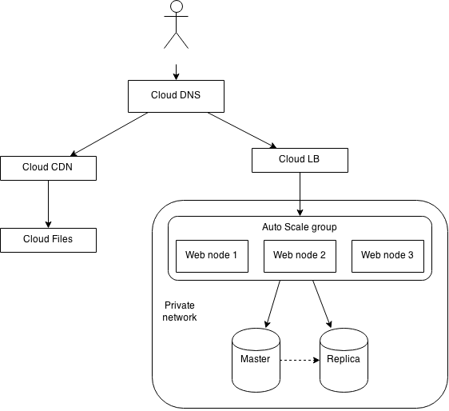

# Multi-tiered web application

## Diagram

## Deployment

### Ansible

### Heat

## Notes

### 1. DNS management

The end-user's request is first routed through Cloud DNS, a globally distributed service which allows a great degree of control over where requests are routed to.  Records can be associated with other Rackspace infrastructure.

### 2. Asset management

Some HTTP requests, such as for asset files, will be delivered to the end-user using the Rackspace CDN and Cloud Files services.

#### CDN

For resources that are accessed a lot, but do not change in content, performance can be improved by caching them in a globally distributed CDN. Content will be cached in local edge nodes, improving redundancy and reducing latency - meaning a better overall experience for your end-users. Using the new Rackspace CDN service, you now have greater control over what aspects of your website is cached.

#### Asset storage

Static assets (images, stylesheets and JavaScript files) can be stored in Rackspace Cloud Files, a highly available and redundant file storage service. Doing this will reduce the compute load on your web nodes since they are no longer handling superfluous web requests for static assets.

### 3. Load Balancers

For the majority of HTTP requests, they will need to be handled by your application, which will be distributed over multiple web servers. To improve performance and allow for automatic failover, a load balancer is needed. This will distribute traffic according to a specific balancing algorithm to all of your web nodes. It has the ability to withdraw a web node from service if it becomes unresponsive.

### 4. Autoscaled Web apps

The load balancer will direct the end-user's request to an available web node, running a local instance of your application. Depending on peaks of traffic, the servers allocated may become overwhelmed - which is why we need to be deployed to an Auto Scale group. Each server will be monitored remotely - for CPU or memory usage, how well it responds on certain TCP ports, etc. - and if the remote monitoring service deems it too slow or unable to respond, a new node will enter the Auto Scale group, and the load balancer will redirect traffic there. This process is fully automatic, seamless and continuous - meaning that your application is extremely resilient and highly available.

### 5. Back-end data storage

For persistent storage, Cloud Databases serves as your relational database solution for MySQL. It allows you to programmatically control access to users, as well create and update databases. Cloud Servers will communicate to the Cloud Database instance over a private IP; since they are located in the same geographic region, you can be better latency guarantees and free bandwidth.

#### Database replication

For greater redundancy, your cloud database instance will spawn multiple slave replicas to better handle read traffic.
